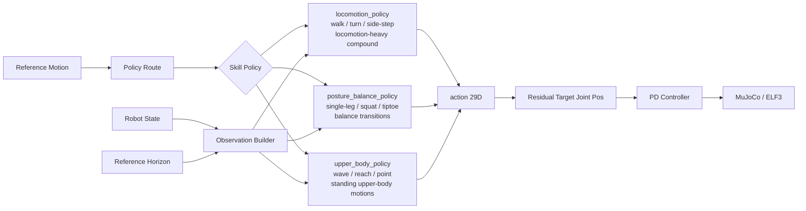

# ELF3 RL 框架详细设计文档

## 目录

1. [项目概述](#项目概述)
2. [数据准备流程](#数据准备流程)
3. [模型架构](#模型架构)
4. [奖励设计](#奖励设计)
5. [训练流程](#训练流程)
6. [部署流程](#部署流程)
7. [实验记录](#实验记录)

---

## 项目概述

### 背景与目标

ELF3 是一个 29 自由度的人形机器人，具有 6 自由度浮空基座。我们的目标是通过强化学习（RL）训练一个闭环控制策略，使 ELF3 能够在物理仿真中稳定地跟踪参考动作轨迹。

**核心挑战**：
- **开环 vs 闭环**：参考动作（NPZ）是开环运动学轨迹，缺少动力学约束。RL 策略需要在物理仿真中闭环控制，处理累积误差和外部扰动。
- **跟踪精度**：策略需要尽可能接近参考动作。
- **稳定性**：策略需要保持机器人平衡，避免摔倒。
- **泛化能力**：策略需要处理 100 条不同类别的参考动作。

### 技术栈

- **仿真器**: MuJoCo 3.9.0
- **RL 框架**: Stable-Baselines3 (PPO)
- **并行训练**: SubprocVecEnv + VecNormalize
- **策略架构**: 3 个 Skill Policy + 显式 Policy Route
- **网络架构**: 按技能复杂度分配 MLP 容量 + ELU 激活
- **观测空间**: 本体状态 + Reference Horizon + 历史/体状态/接触信息
- **动作空间**: 29 维（残差控制）

---

## 数据准备流程

### NPZ 数据格式

参考动作数据来自 g1→elf3 retargeting 工作流，存储在 NPZ 文件中。每个文件包含：

```python
{
    'qpos_elf3': (T, 36),      # 完整 qpos（7 root + 29 joints）
    'joint_pos': (T, 29),      # 关节角度
    'joint_vel': (T, 29),      # 关节角速度
    'body_pos_w': (T, 30, 3),  # 体位置（30 个 body）
    'body_lin_vel_w': (T, 30, 3),  # 体线速度
    'foot_contacts': (T, 4),   # 脚部接触点（左脚前/后、右脚前/后）
    'fps': 30.0,               # 采样频率
    'category': 'locomotion'   # 动作类别
}
```

### 数据结构

训练集只包含分类子目录中的 100 条参考动作：

```
generated_elf3_baseline/
├── balance/        (10 clips)  # 静态平衡（站立、单脚站）
├── upper_body/     (30 clips)  # 上肢动作（挥手、举臂）
├── locomotion/     (40 clips)  # 步态（行走、侧步、转身）
└── compound/       (20 clips)  # 复合动作（行走+挥手、蹲下+转身）
```

`generated_elf3_baseline/` 根目录下的旧 baseline NPZ 不纳入训练，也不进入 `policy_route.yaml` 的训练集合；它们只可作为 smoke test、回归评估或调试素材。

RL 环境加载时会把 4 个脚部接触点归并为左右脚 2 维观测。

### 数据验证

使用 `batch_generate_rl_data.sh` 脚本验证所有 NPZ 文件：
- 检查必需字段是否存在
- 检查数组形状是否正确
- 统计每个类别的 clip 数量

### 数据加载边界

训练和正式评估必须显式声明加载范围：

| 用途 | 加载范围 | 是否包含根目录旧 baseline |
| --- | --- | --- |
| `train` | `balance/`, `upper_body/`, `locomotion/`, `compound/` 中被 Policy Route 选中的 Training Motion | 否 |
| `benchmark_eval` | 分类子目录中的固定评估清单 | 否 |
| `debug_eval` | 显式传入的调试 clip，可包含根目录旧 baseline | 是 |

实现上不允许继续依赖“扫描整个 `motion_dir` 并自动加载根目录 NPZ”的默认行为作为训练路径；根目录旧 baseline 只能由 `debug_eval` 显式打开。

---

## 模型架构

### 观测空间 (586 维)

观测空间分为 5 个部分：

#### 1. 本体状态 (78 维)

```python
root_height (1)           # 基座高度
root_lin_vel (3)          # 基座线速度
root_ang_vel (3)          # 基座角速度
gravity_proj (3)          # 重力向量在机体坐标系的投影
phase_sin_cos (2)         # 相位编码（sin/cos）
action_mean (1)           # 上一步动作均值
joint_pos (29)            # 当前关节角度
joint_vel (29)            # 当前关节角速度
root_quat (4)             # 基座四元数
root_pos (3)              # 基座位置 (xyz)
```

**总计**: 1 + 3 + 3 + 3 + 2 + 1 + 29 + 29 + 4 + 3 = 78 维

#### 2. Reference Horizon (268 维)

策略不只观察当前参考帧，而是观察 4 个参考点：

```python
horizon_offsets = [0, 3, 6, 12]  # 当前帧、约 0.1s、0.2s、0.4s lookahead（30 fps）
```

每个参考点包含 67 维：

```python
ref_joint_pos (29)        # 参考关节角度
ref_joint_vel (29)        # 参考关节角速度
ref_root_delta_local (3)  # 参考基座相对当前 root 的局部坐标位移
ref_root_quat (4)         # 参考基座四元数
ref_foot_contact (2)      # 参考脚部接触
```

**单点总计**: 29 + 29 + 3 + 4 + 2 = 67 维  
**Horizon 总计**: 4 × 67 = 268 维

`ref_root_delta_local` 使用机器人局部坐标，而不是世界坐标：

```python
ref_root_delta_local = rotate_inv(current_root_quat, ref_root_pos - current_root_pos)
```

#### 3. 历史信息 (58 维)

```python
last_action (29)          # 上一步动作
action_before_last (29)   # 上上步动作
```

**总计**: 29 + 29 = 58 维

#### 4. 体状态 (180 维)

```python
body_pos (90)             # 30 个 body 的位置 (30×3)
body_vel (90)             # 30 个 body 的速度 (30×3)
```

**总计**: 90 + 90 = 180 维

#### 5. 脚部接触 (2 维)

```python
foot_contact (2)          # 当前脚部接触状态
```

**总计**: 2 维

**总维度**: 78 + 268 + 58 + 180 + 2 = 586 维

### 动作空间 (29 维)

动作空间采用**残差控制**策略：

```python
# 策略输出
action ∈ [-1, 1]^29

# 目标关节角度
target_joint_pos = ref_joint_pos + action * action_scale

# action_scale = 0.3 rad
```

**优点**：
- 策略只需学习相对于参考动作的修正量
- 限制策略偏离参考动作的幅度，提高稳定性
- 初始策略（action=0）就能产生合理的动作

### PD 控制器

```python
tau = kp * (target_joint_pos - joint_pos) - kd * joint_vel

# 默认参数
kp = 100.0
kd = 5.0
```

力矩通过 `qfrc_applied[6:35]` 施加到 29 个关节（跳过根自由度的 6 个维度）。

### 策略集合与路由

当前设计不再使用一个 Universal Tracking Policy 覆盖所有动作，而是使用 3 个 Skill Policy。每条参考动作通过显式 Policy Route 指定要使用的策略；路由边界按动作动力学复杂度划分，不按数据目录机械划分。

相关决策记录: [ADR 0001: Three Skill Policies With Explicit Routing](docs/adr/0001-three-skill-policies-with-explicit-routing.md)



Policy Route 按 motion 文件名精确维护，key 使用不含 `.npz` 后缀的 motion stem。目录名、动作类别和关键词规则不能作为路由真值。

```yaml
# config/policy_route.yaml
walk_forward: locomotion_policy
turn_left: locomotion_policy
walk_and_wave_left: locomotion_policy

single_leg_stand_left: posture_balance_policy
squat_to_stand: posture_balance_policy
tiptoe_walk: posture_balance_policy

wave_left_hand: upper_body_policy
point_forward_right: upper_body_policy
raise_both_arms: upper_body_policy
```

Route 表必须覆盖所有 100 条 Training Motion。加载训练集时如果出现以下情况，应直接失败：

- Training Motion 没有 Policy Route
- Policy Route 指向未知 Skill Policy
- 同一个 motion stem 在训练集合中重复出现
- Policy Route 指向根目录旧 baseline

### 配置文件设计

多策略训练需要把全局单策略配置拆成 3 个显式配置文件：

```text
config/
├── default.yaml          # MuJoCo、PD、仿真、通用 PPO 默认值
├── policy_route.yaml     # motion stem -> Skill Policy
├── policy_configs.yaml   # 每个 Skill Policy 的网络、奖励、训练步数、课程学习
└── eval_sets.yaml        # benchmark_eval/debug_eval 的 clip 清单
```

`policy_configs.yaml` 的结构：

```yaml
policies:
  locomotion_policy:
    net_arch:
      pi: [1024, 512, 256]
      vf: [1024, 512, 256]
    total_timesteps: 50000000
    reward_weights:
      joint_position: 0.22
      joint_velocity: 0.12
      end_effector_pos: 0.12
      root_position: 0.12
      survival: 0.04
      com_height: 0.12
      energy: 0.04
      smoothness: 0.08
      foot_penetration: 0.07
      foot_airborne: 0.07
    curriculum:
      phase1_ratio: 0.4
      phase2_ratio: 0.6
      phase1_motions:
        - walk_forward
        - walk_forward_slow
        - side_step_left
        - side_step_right

  posture_balance_policy:
    net_arch:
      pi: [768, 512, 256]
      vf: [768, 512, 256]
    total_timesteps: 35000000
    reward_weights:
      joint_position: 0.25
      joint_velocity: 0.08
      end_effector_pos: 0.14
      root_position: 0.05
      survival: 0.05
      com_height: 0.18
      energy: 0.04
      smoothness: 0.10
      foot_penetration: 0.07
      foot_airborne: 0.04

  upper_body_policy:
    net_arch:
      pi: [512, 256]
      vf: [512, 256]
    total_timesteps: 20000000
    reward_weights:
      joint_position: 0.32
      joint_velocity: 0.08
      end_effector_pos: 0.22
      root_position: 0.02
      survival: 0.06
      com_height: 0.14
      energy: 0.04
      smoothness: 0.08
      foot_penetration: 0.03
      foot_airborne: 0.01
```

### 网络架构

3 个 Skill Policy 使用相同的观测 schema 和动作接口，但按技能复杂度分配不同网络容量：

| Skill Policy | 覆盖动作 | 建议网络容量 |
| --- | --- | --- |
| `upper_body_policy` | 上肢动作、站立上肢组合动作 | `pi/vf=[512, 256]` |
| `posture_balance_policy` | 单脚、蹲起、踮脚、重心转移动作 | `pi/vf=[768, 512, 256]` |
| `locomotion_policy` | 行走、转弯、侧步、步态复合动作 | `pi/vf=[1024, 512, 256]` |

```python
# 每个 Skill Policy 都保持相同接口
policy_input = observation          # 本体状态 + Reference Horizon + 历史/体状态/接触信息
action = skill_policy(policy_input) # (29,), clipped to [-1, 1]
target_joint_pos = ref_joint_pos + action * action_scale
```

---

## 奖励设计

### 奖励函数组成

总奖励 = 跟踪奖励(60%) + 稳定性奖励(30%) + 脚部惩罚(10%)

奖励组件在 3 个 Skill Policy 之间共享，但权重按策略分别配置。这样可以保持实现一致，同时避免一种权重同时压制步态、平衡和上肢动作。

| Skill Policy | 奖励侧重点 |
| --- | --- |
| `locomotion_policy` | root 跟踪、脚部接触、速度连续性、步态稳定 |
| `posture_balance_policy` | 高度/姿态稳定、脚底接触、低抖动 |
| `upper_body_policy` | 上肢关节跟踪、手部末端跟踪、站立稳定 |

#### 1. 跟踪奖励 (60%)

**关节位置跟踪 (30%)**
```python
joint_pos_reward = exp(-5.0 * ||joint_pos - ref_joint_pos||²)
```

**关节速度跟踪 (10%)**
```python
joint_vel_reward = exp(-0.1 * ||joint_vel - ref_joint_vel||²)
```

**末端执行器跟踪 (15%)**
```python
# 跟踪手腕和脚踝的位置
ee_indices = [l_wrist_z_link, r_wrist_z_link, l_ankle_x_link, r_ankle_x_link]
ee_pos_reward = exp(-10.0 * ||ee_pos - ref_ee_pos||²)
```

**基座位置跟踪 (5%)**
```python
root_pos_reward = exp(-2.0 * ||root_pos - ref_root_pos||²)
```

#### 2. 稳定性奖励 (30%)

**存活奖励 (5%)**
```python
survival_reward = 0.01  # 每步固定奖励
```

**重心高度 (15%)**
```python
com_height_reward = exp(-10.0 * (com_height - 1.0)²)
# 目标高度: 1.0m
```

**能量惩罚 (5%)**
```python
energy_reward = -0.001 * sum(tau²)
# 惩罚过大的关节力矩
```

**动作平滑 (5%)**
```python
smoothness_reward = -0.01 * ||action - last_action||²
# 鼓励动作平滑过渡
```

#### 3. 脚部惩罚 (10%)

**穿地惩罚 (5%)**
```python
if foot_z < -0.02:
    penetration_penalty = bounded_exp_penalty(50 * (-0.02 - foot_z))
else:
    penetration_penalty = 0
```

**悬空惩罚 (5%)**
```python
if foot_z > 0.06 and ref_foot_z < 0.04:
    # 意外悬空（参考动作中脚在地面）
    airborne_penalty = bounded_exp_penalty(20 * (foot_z - 0.06))
else:
    airborne_penalty = 0
```

所有指数惩罚必须有上界，并且总奖励必须做 finite clipping，避免 PPO/VecNormalize 被 Inf/NaN 污染。

### 脚部悬空惩罚缩放

某些动作需要脚离地（如行走、踢腿），此时悬空惩罚应被降低。该机制只影响奖励，不是选择 Skill Policy 的 Policy Route。

**自动检测逻辑**：
```python
# 检查参考动作中脚部是否离地
if max(ref_foot_z) > 0.10:
    # 这是允许离地的动作
    airborne_penalty *= 0.1  # 大幅降低惩罚
```

### 终止条件

1. **摔倒**：
   - 基座高度 < 0.5m
   - 俯仰角 > 45° (0.785 rad)
   - 横滚角 > 45° (0.785 rad)
   - 惩罚: -10.0

2. **跟踪失败**：
   - 关节误差 > 1.0 rad 持续 50 步
   - 惩罚: -5.0

3. **超时**：
   - 达到最大步数 (1000 步)
   - 奖励: +5.0

---

## 训练流程

### Skill Policy 独立训练

3 个 Skill Policy 完全独立训练。每个策略只加载 Policy Route 分配给自己的参考动作，并拥有独立 checkpoint、独立 VecNormalize 统计和独立导出文件。

独立训练不改变部署接口：

```python
observation: (586,)
action: (29,)
```

| Skill Policy | 训练数据来源 | Checkpoint 目录 |
| --- | --- | --- |
| `locomotion_policy` | 行走、转弯、侧步、步态复合动作 | `research/retarget_g1_to_elf3/rl/checkpoints/elf3_rl/locomotion_policy/` |
| `posture_balance_policy` | 单脚、蹲起、踮脚、重心转移动作 | `research/retarget_g1_to_elf3/rl/checkpoints/elf3_rl/posture_balance_policy/` |
| `upper_body_policy` | 上肢动作、站立上肢组合动作 | `research/retarget_g1_to_elf3/rl/checkpoints/elf3_rl/upper_body_policy/` |

### 每个 Skill Policy 内部的课程学习

#### Phase 1: 简单动作 + 低扰动

**训练范围**:
- 当前 Skill Policy 中最简单、最稳定的参考动作
- 固定从 phase=0 开始，优先学习完整动作序列
- 使用该 Skill Policy 总训练步数的前 40%

**域随机化**:
- 重力: ±5%
- 地面摩擦: 0.8~1.2
- PD 增益: ±20%
- 初始状态: 位置 ±5cm，速度 ±0.1 m/s

#### Phase 2: 所有动作 + 高扰动

**训练范围**:
- 当前 Skill Policy 路由到的全部参考动作
- 随机相位 [0, 1]，学习从任意位置恢复
- 使用该 Skill Policy 总训练步数的后 60%

**域随机化**:
- 重力: ±10%
- 地面摩擦: 0.5~1.5
- PD 增益: ±20%
- 初始状态: 位置 ±5cm，速度 ±0.1 m/s

### PPO 超参数

```python
num_envs = 64            # 并行环境数
n_steps = 2048           # 每个环境每轮收集的步数
batch_size = 2048        # 训练批次大小
n_epochs = 10            # 每批数据的训练轮数
learning_rate = 3e-4     # 学习率
gamma = 0.99             # 折扣因子
gae_lambda = 0.95        # GAE lambda
clip_range = 0.2         # PPO 裁剪范围
ent_coef = 0.01          # 熵正则化系数
```

总训练步数按 Skill Policy 配置：

| Skill Policy | 总训练步数 |
| --- | ---: |
| `upper_body_policy` | 20M |
| `posture_balance_policy` | 35M |
| `locomotion_policy` | 50M |
 

### GPU 选择

```python
# 自动选择占用最低的 2 张 GPU
def select_gpus(n_gpus=2):
    # 查询 8 张 GPU 的显存使用
    # 返回占用最低的 n_gpus 张
    # 设置 CUDA_VISIBLE_DEVICES
```

### 训练命令

```bash
# 训练单个 Skill Policy
python -m research.retarget_g1_to_elf3.rl.training.train \
  --policy-id locomotion_policy \
  --n-gpus 2

# 分别训练三个 Skill Policy
python -m research.retarget_g1_to_elf3.rl.training.train --policy-id locomotion_policy
python -m research.retarget_g1_to_elf3.rl.training.train --policy-id posture_balance_policy
python -m research.retarget_g1_to_elf3.rl.training.train --policy-id upper_body_policy

# 强制指定某个 Skill Policy 的阶段
python -m research.retarget_g1_to_elf3.rl.training.train --policy-id locomotion_policy --curriculum-phase 1
python -m research.retarget_g1_to_elf3.rl.training.train --policy-id locomotion_policy --curriculum-phase 2 --resume research/retarget_g1_to_elf3/rl/checkpoints/elf3_rl/locomotion_policy/phase1_model
```

### 监控指标

- **跟踪误差**: `||joint_pos - ref_joint_pos||²`
- **存活步数**: episode 长度
- **奖励曲线**: 每步奖励
- **终止原因**: 摔倒 / 跟踪失败 / 超时
- **仿真不稳定率**: `simulation_unstable` 终止次数 / rollout episode 数

### 运行时约束与训练前门槛

当前已存在用户级 conda 运行时 `/home/chengjunhao/miniforge3/envs/kimodo-elf3-rl`，真实 Gymnasium/SB3 smoke 已验证旧版 385 维单策略路径能跑完 32 步 PPO。该 smoke 同时暴露了 MuJoCo `QACC` 不稳定风险，代码中已有以下防护必须保留：

- 对非有限 action 做 `nan_to_num` 和 action space clip
- 对脚部指数惩罚做有界化，避免 reward 变成 Inf/NaN
- 检测非有限 MuJoCo state，使用 `termination_reason='simulation_unstable'` 提前终止

这些防护只是训练安全网，不代表动作质量已经可接受。任何 50k+ step 训练前，必须先对 3 个 Skill Policy 分别跑短 rollout audit，确认 `simulation_unstable` 的频率、触发动作和触发 phase。

---

## 部署流程

### ONNX 导出

```python
# 每个 Skill Policy 单独导出策略网络（不含价值网络）
export_onnx(
    model_path="research/retarget_g1_to_elf3/rl/checkpoints/elf3_rl/locomotion_policy/final_model",
    output_path="research/retarget_g1_to_elf3/rl/exports/locomotion_policy.onnx",
    obs_dim=586
)
```

**ONNX 模型规格**:
- 输入: observation (1, 586)
- 输出: action (1, 29)
- 每个 Skill Policy 单独导出一个 ONNX 文件
- Policy Route 在推理前选择要加载/调用的 ONNX 模型

### NPZ 权重导出

```python
# 每个 Skill Policy 单独导出网络权重为 NumPy 数组
export_npz(
    model_path="research/retarget_g1_to_elf3/rl/checkpoints/elf3_rl/upper_body_policy/final_model",
    output_path="research/retarget_g1_to_elf3/rl/exports/upper_body_policy_weights.npz"
)
```

**NPZ 文件内容示例（upper_body_policy）**:
```python
{
    'mlp_extractor.policy_net.0.weight': (512, 586),
    'mlp_extractor.policy_net.0.bias': (512,),
    'mlp_extractor.policy_net.2.weight': (256, 512),
    'mlp_extractor.policy_net.2.bias': (256,),
    'action_net.weight': (29, 256),
    'action_net.bias': (29,)
}
```

### 推理流程

```python
# 1. 根据参考动作选择 Skill Policy
policy_name = policy_route[reference_motion_name]
session = onnxruntime.InferenceSession(f"exports/{policy_name}.onnx")

# 2. 构建观测 (586 维)
obs = build_observation(...)

# 3. 推理
action = session.run(None, {'observation': obs})[0]  # (1, 29)

# 4. 计算目标关节角度
target_joint_pos = ref_joint_pos + action[0] * 0.3

# 5. PD 控制
tau = 100 * (target_joint_pos - joint_pos) - 5 * joint_vel

# 6. 施加力矩
apply_torques(tau)
```

---

## 实验记录

### 训练日志

每次训练后记录以下信息：

```markdown
## 实验 #1: 基础训练

**日期**: 2026-06-03
**配置**: default.yaml
**训练时间**: 19 小时

### 结果
- 平均跟踪误差: 0.05 rad
- 平均存活步数: 850 / 1000
- 成功率 (存活 > 500 步): 85%

### 观察
- 上肢动作学习效果最好（误差 < 0.02 rad）
- 步态动作仍有改进空间（误差 ~0.08 rad）
- 转弯动作容易摔倒

### 改进方向
- 增加步态类动作的训练权重
- 调整摔倒惩罚系数
```

### 评估脚本

评估分为两类：

- `benchmark_eval`: 正式对比训练效果，只使用分类子目录中的训练/验证动作清单，不使用根目录旧 baseline。
- `debug_eval`: smoke test、回归检查和视频调试，可以使用根目录旧 baseline NPZ。

```bash
# 评估单个 Skill Policy
python -m research.retarget_g1_to_elf3.rl.eval.evaluate \
    research/retarget_g1_to_elf3/rl/checkpoints/elf3_rl/locomotion_policy/final_model.zip \
    --policy-id locomotion_policy \
    --eval-set benchmark_eval

# 渲染演示视频
python -m research.retarget_g1_to_elf3.rl.eval.evaluate \
    research/retarget_g1_to_elf3/rl/checkpoints/elf3_rl/locomotion_policy/final_model.zip \
    --policy-id locomotion_policy \
    --eval-set debug_eval \
    --render research/retarget_g1_to_elf3/rl/demos/elf3_eval.mp4 \
    --clip walk_forward
```

### 失败案例分析

常见失败模式：
1. **早期摔倒**: 初始扰动过大，调整域随机化范围
2. **关节抖动**: PD 增益过高或动作不平滑，增加平滑性奖励权重
3. **跟踪偏移**: 参考动作不可行，检查 IK 求解结果
4. **类别不平衡**: 某些动作学得好/差，调整采样权重

---

## 附录

### A. ELF3 关节列表

```
waist_y_joint, waist_x_joint, waist_z_joint,
l_hip_y_joint, l_hip_x_joint, l_hip_z_joint,
l_knee_y_joint, l_ankle_y_joint, l_ankle_x_joint,
r_hip_y_joint, r_hip_x_joint, r_hip_z_joint,
r_knee_y_joint, r_ankle_y_joint, r_ankle_x_joint,
l_shoulder_y_joint, l_shoulder_x_joint, l_shoulder_z_joint,
l_elbow_y_joint, l_wrist_x_joint, l_wrist_y_joint, l_wrist_z_joint,
r_shoulder_y_joint, r_shoulder_x_joint, r_shoulder_z_joint,
r_elbow_y_joint, r_wrist_x_joint, r_wrist_y_joint, r_wrist_z_joint
```

### B. 关键文件路径

```
rl/
├── DESIGN.md                    # 本文档
├── IMPLEMENTATION_PLAN.md       # 实施计划
├── config/
│   ├── default.yaml             # MuJoCo、PD、仿真、通用 PPO 默认值
│   ├── policy_route.yaml        # motion stem -> Skill Policy
│   ├── policy_configs.yaml      # 每个 Skill Policy 的网络、奖励、训练步数
│   └── eval_sets.yaml           # benchmark_eval/debug_eval 清单
├── docs/
│   └── adr/
│       └── 0001-three-skill-policies-with-explicit-routing.md
├── env/
│   ├── elf3_env.py              # 环境实现
│   ├── reference_motion.py      # 参考动作管理
│   └── rewards.py               # 奖励函数
├── training/
│   ├── train.py                 # 训练脚本
│   ├── gpu_selector.py          # GPU 选择
│   └── callbacks.py             # 回调函数
├── eval/
│   └── evaluate.py              # 评估 + 可选视频渲染
└── export/
    └── export_model.py          # 模型导出
```

### C. 参考文献

1. **DeepMimic**: Learning Physics-Based Motion Skills with Deep RL
2. **AMP**: Adversarial Motion Priors
3. **PPO**: Proximal Policy Optimization Algorithms
4. **Domain Randomization**: Sim-to-Real Transfer of Robotic Control with Dynamics Randomization

---

**文档版本**: v1.1  
**最后更新**: 2026-06-03  
**维护者**: Chengjunhao
